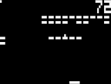
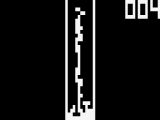
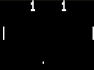
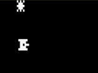

# chip8-lean4

Chip-8 interpreter written in Lean.

## Usage

```bash
lake build
./build/bin/chip8 [OPTION]... ROM
```

### Parameters

* `--volume V` sound volume: nonnegative integer, maximum: 100, default: 30
* `--ram R` ram size: integer, minimum: 512 + rom size, default: 4096
* `--ips IPS` instructions per second: nonnegative integer, default: 600
* `--stack SS` stack size: nonnegative integer, default: 128
* `--dw DW` display pixel width: nonnegative integer, default: 64
* `--dh DH` display pixel height: nonnegative integer, default: 32
* `--c0 C0` color of unlit pixels: see below, default: "black"
* `--c1 C1` color of lit pixels: see below, default: "white"

#### Colors

Available colors: `lightgray`, `gray`, `darkgray`, `yellow`, `gold`, `orange`, `pink`, `red`, `maroon`, `green`, `lime`, `darkgreen`, `skyblue`, `blue`, `darkblue`, `purple`, `violet`, `darkpurple`, `beige`, `brown`, `darkbrown`, `black`, `magenta`, `white`.

### Quirks

* `--Qjump-offset` or `--Qno-jump-offset`, default: false
* `--Qshift` or `--Qno-shift`, default: false
* `--Qindex-add` or `--Qno-index-add`, default: false
* `--Qmem-index:keep`, `--Qmem-index:addx` or `--Qmem-index:addx1`, default: `addx1`
* `--Qbitwise-flag` or `--Qno-bitwise-flag`, default: true
* `--Qdisplay-int` or `--Qno-display-int`, default: true
* `--Qget-key-rel` or `--Qno-get-key-rel`, default: true

See descriptions in [Config.lean](src/Chip8/Config.lean).
[Example](./modern.sh) preset compatible with some roms not working with default configuration, e.g., space invaders.

## Screenshots





